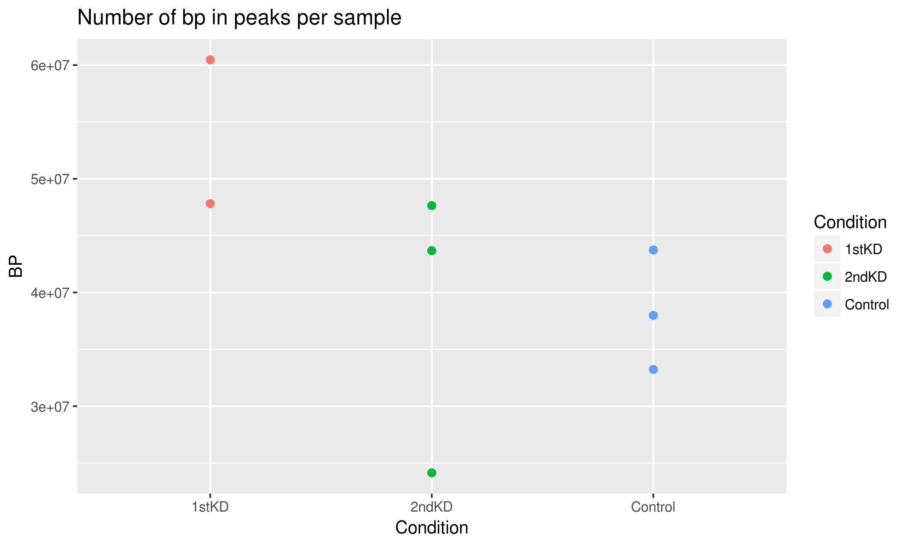
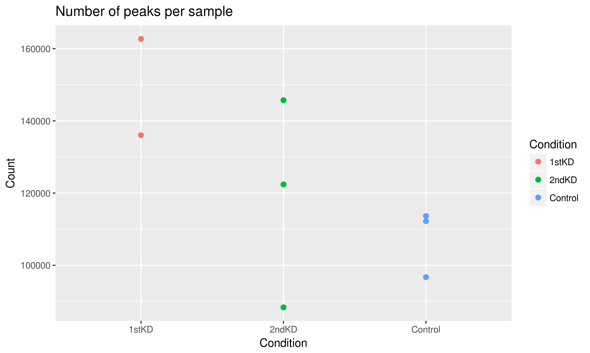
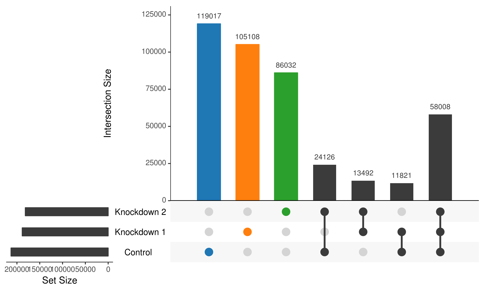
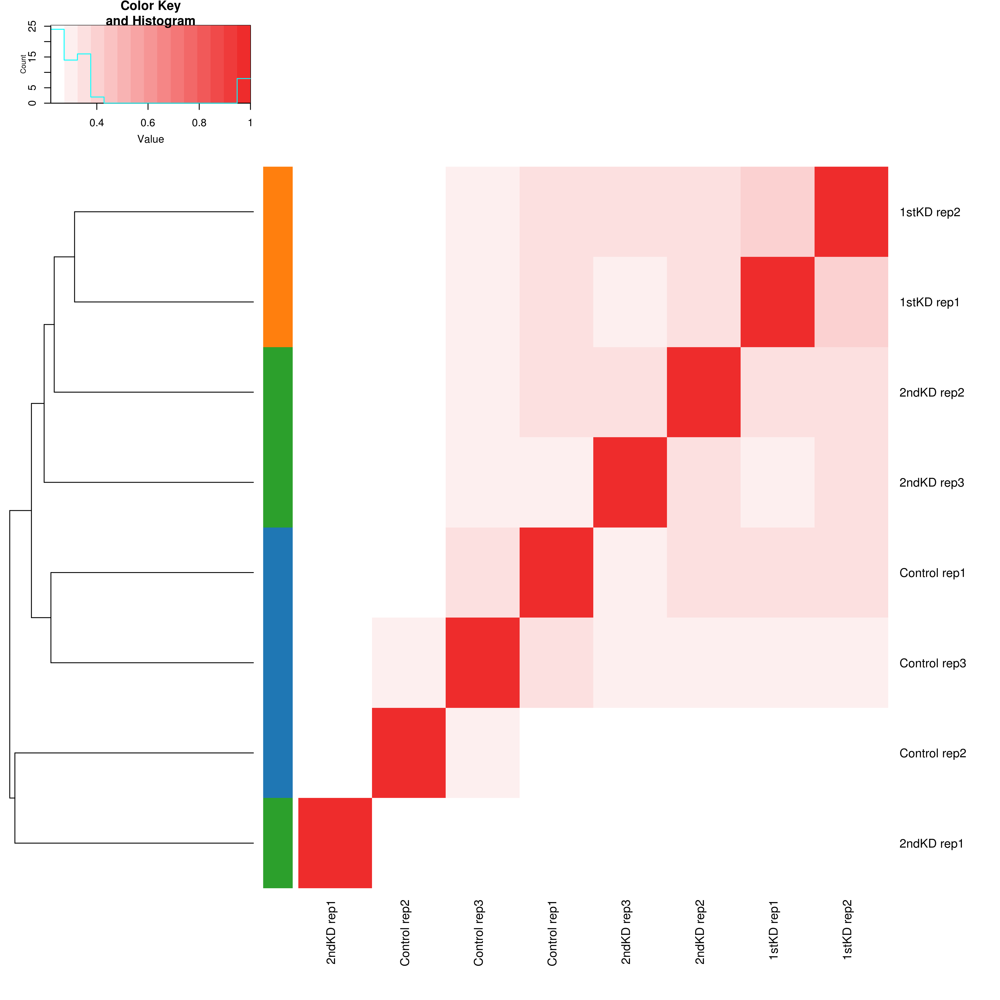

# Summary

This folder is probing the question of whether there are differences in global chromatin accessibility between each of the 3 conditions.

## Materials and Methods

Using `bp-accessible.sh`, I calculated the number of base pairs in called peaks for each sample.
Using `peaks-accessible.sh`, I calculated the number of called peaks for each sample.
The results are stored in `num-bp.tsv` and `num-peaks.tsv`, respectively.

To see how similar the ATAC profiles are to each other, overall, I have calculated overlaps using UpSet plots and Jaccard indices between the samples.

We create a consesus peak set by merging all the narrowPeak files together via `sh consensus-set.sh`, then created a binary matrix using `create-binary-matrix.R`.
This is fed into `upset.R` to calculate intersections.
Jaccard indices are calculated via `calculate-jaccard.sh`, and a heatmap is generated using `jaccard.R`.

## Results

### Controls tend to have less accessible chromatin, but it is not statistically significant

To see whether there are differences in global accessibility between each of the 3 conditions, we can count the number of peaks from each sample, as well as the total number of base pairs contained within peaks.

We see that using both metrics, the Control case tends to have the least accessible chromatin, whereas the TAZ knockdowns tend to have more.

None of the conditions are significantly different from each other (2 sample permutation test, see `global-accessibility.R`).
The results of the tests are as follows:

| X       | Y   | Data  | Hypothesis | _p_    |
| ------- | --- | ----- | ---------- | ------ |
| Control | KD1 | BP    | X >= Y     | 0.0667 |
| Control | KD2 | BP    | X >= Y     | 0.4677 |
| KD1     | KD2 | BP    | X = Y      | 0.2667 |
| Control | KD1 | Peaks | X >= Y     | 0.0667 |
| Control | KD2 | Peaks | X >= Y     | 0.2903 |
| KD1     | KD2 | Peaks | X = Y      | 0.4    |

### Most peaks are unique to the condition

The intersection of each condition gives us the following separation of peaks:

A majority of peaks are specific to the condition, while there is a shared set of peaks amongst all three conditions.

### Replicates mostly cluster together but are not very similar

Jaccard indices of peaks from each sample give us the following clustering:

Most samples of the same condition do tend to cluster together, except for KD2 Rep 1 (this same sample also had low counts for number of bp and peaks).
However, none of the replicates tend to be too similar to each other.
The similarity of ATAC profiles between replicates tends to be about the same as that between different conditions.

## Conclusions

There tends to be more accessible chromatin in the knockdowns compared to the control, but these differences are not statistically significant.
