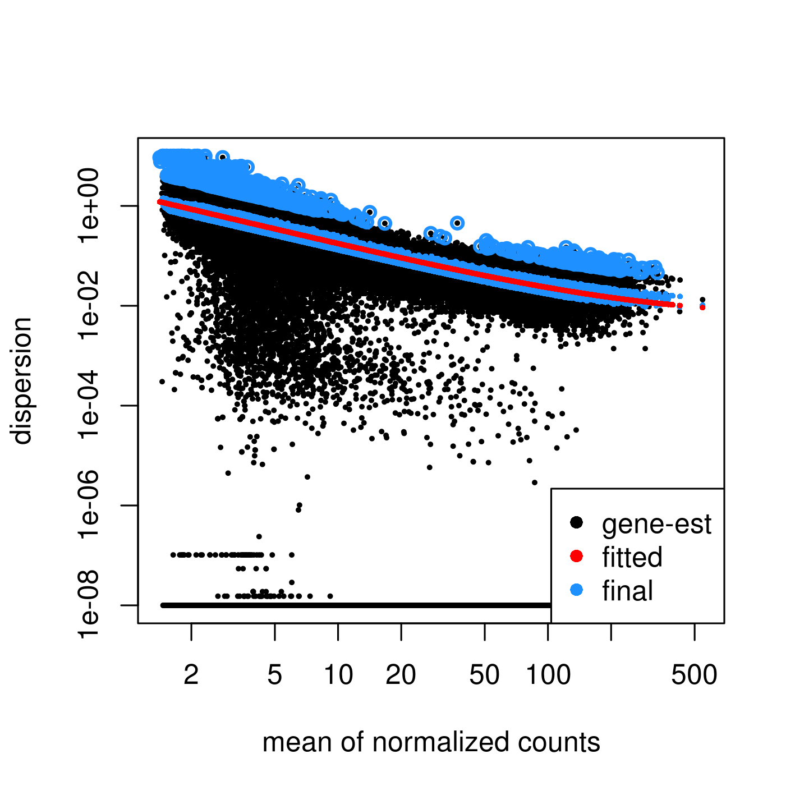

# Summary

## Differential accessibility

To calculate differential accessibility, I'm following advice from Aditi and online and using DESeq2.
This is designed for differential expression, but the idea is that you have a defined list of genomic regions from a set of samples and read counts for those regions.
You want to see if there's a significant shift in the counts between certain sets of samples.

The process to use this for ATAC-seq data is then:

1. Generate a consensus peak set
    1. Merge peaks from all samples
2. Use sample BAMs to count the number of reads for each sample in this consensus set
    * Can use `bedtools coverage` with the BAM
    * Could also use `featureCounts` function in `Rsubread` package
3. Feed this raw count matrix into the `DESeq` function in `DESeq2`
    * See [DESeq2's info page](https://bioconductor.org/packages/release/bioc/vignettes/DESeq2/inst/doc/DESeq2.html#count-matrix-input)

I'm getting very strange dispersion plots and other QC plots for these samples.
For example:

This isn't great, and I'm not sure why this is the case.
Additionally, the BAM for 1stKD rep1 is missing in the original data, and I need that to count reads in the consensus peak list for 1stKD.
It's missing and I've asked the genomics core to re-run the data preprocessing pipeline so that I can make sure I have all the data.

## Conclusions

I'm leaving this data alone for now, and I'll try again at a later date when the samples are re-run and I have all the data I need.
But I'll commit all these results for posterity.

## 2018-10-31 Update

These peak lists use a filter of p < 0.01, which is not a very stringent filter.
I'm not sure how much I trust these, given that there seems to be a lot of noise and very high peak counts for consensus lists.
I'm going to try some manual filtering on these re-preprocessed data samples, then try this type of analysis again.
