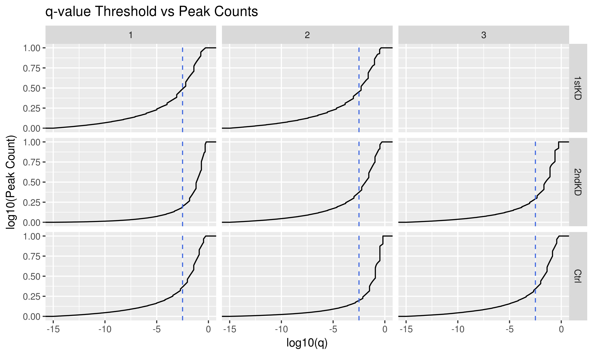
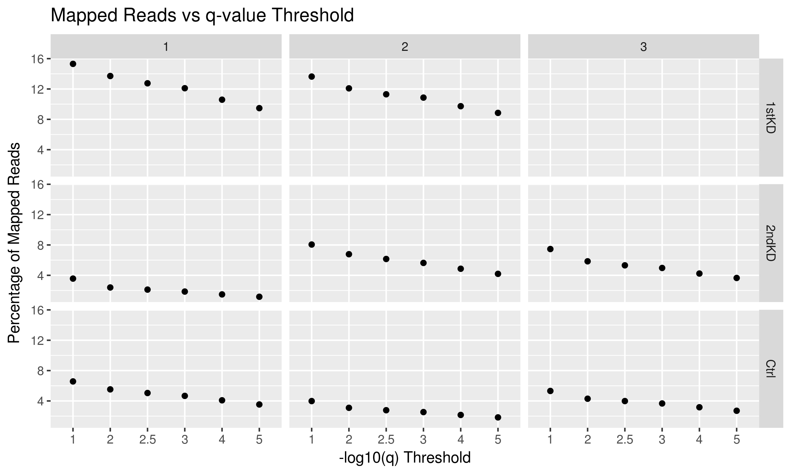

# Summary

In this folder, I'm attempting to filter the peaks according to a few metrics to see if I can make the lists more stringent for each sample.
Previous analyses in the other `Results/` folders were a bit strange and seemed to be coming from the noise in off-peak reads and in the called peaks themselves.

I'm attempting to address this by doing a couple things:

1. Find the trade-off between q-value and number of peaks
2. Find the percentage of non-peak reads (i.e. noise)

## Results

### q-value vs Peak Counts

Using a q-value cutoff of -log10(q) > 2.5 (i.e. q <~ 0.003) returns between 20-50% of peaks with p < 0.01.
For a variety of thresholds, the peak counts can be found in `Filter/logq_{threshold}/peak-counts.tsv`.

### Off-peak noise

I generated filtered peak lists based on different q-value thresholds via `Rscript filter-peaks.R`.
Chr X, Y, MT, and non-canonical chromosomes were also removed with `sh filter-noncanonical-chrs.sh`.

The number of total (non-duplicate) reads for each sample is as follows (as determined via `count-mapped-reads.sh`):

| Condition | Replicate | Mapped Reads |
| --------- | --------- | ------------ |
| 1stKD     | 1         | 15262836     |
| 1stKD     | 2         | 27004173     |
| 2ndKD     | 1         | 25483905     |
| 2ndKD     | 2         | 25376670     |
| 2ndKD     | 3         | 30794437     |
| Ctrl      | 1         | 33802938     |
| Ctrl      | 2         | 30224754     |
| Ctrl      | 3         | 33243705     |

I then counted the number of reads that align to the peaks filtered at various thresholds via `qsub count-reads-in-peaks.sh`.
The result is also stored in `Counts/mapped-reads.tsv`.
My first attempt at this may have underestimated the true percentage of reads in peaks because I filtered the X, Y, M, and non-canonical chromosomes, but did not filter those chromosomes from the mapped read counts.
This has since been updated and corrected for, making use of `hg38-chrom-sizes.bed`, which was downloaded on 2018-11-08 from https://github.com/igvteam/igv/blob/master/genomes/sizes/hg38.chrom.sizes.

We get the following percentages for reads called within peaks (generated via `Rscript plot-reads-in-peaks.R`):

As can be seen in the figure above, the drop-offs are pretty linear wrt the threshold in log space.
Using a threshold of 2.5 is a good middle-of-the-pack cutoff with peak counts in the 17K - 82K range across all samples.

The 1stKD has the best signal-to-noise ratio for its samples, since the percentage of reads in peaks is ~ 18% for this threshold, whereas for the 2ndKD it's beween 2.5-8%, and 5-10% for the controls.
**This might be a cause for concern.**
Aditi mentioned that this seemed extremely low, and some of the GBM samples she had ATAC data for were closer to 38%.
So it may be possible that these experimental results were just really poor.

## Conclusions

Using a q-value threshold of -log10(q) >= 2.5 is a good threshold that keeps reasonable read counts and moderate signal-to-noise ratios across all samples.
I'll be using the peak list from these filtered peaks moving forward.
It's worth keeping in mind that this data may be very noisy, and not as valuable as initially thought.
