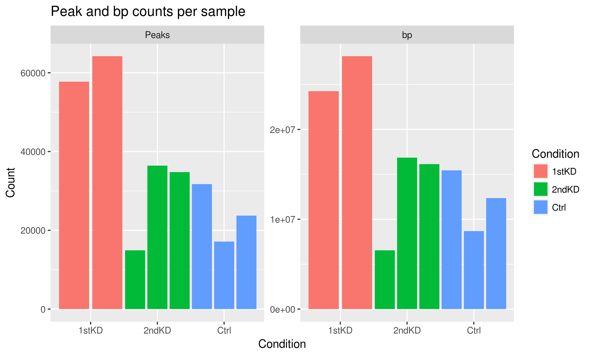
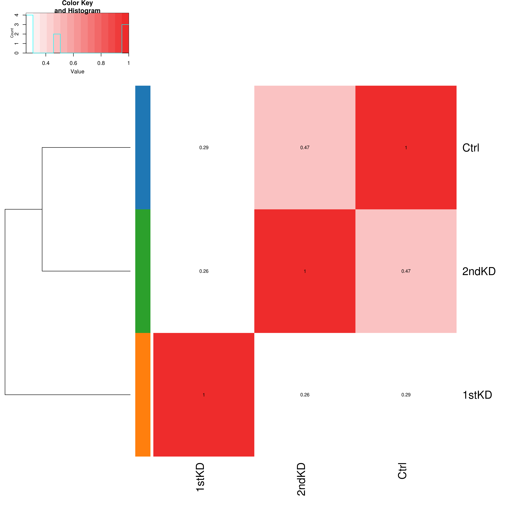

# Summary

Following up from `2018-10-10_global-accessibility/` using the re-preprocessed data and filtered peak lists from `2018-10-31_filtered-peaks/Filter/logq_2.5/`.

## Results

### Controls tend to have less accessible chromatin, but it is not statistically significant

To see whether there are differences in global accessibility between each of the 3 conditions, we can count the number of peaks from each sample, as well as the total number of base pairs contained within peaks.

We see that using both metrics, the Control case tends to have the least accessible chromatin, whereas the TAZ knockdowns tend to have more.

None of the conditions are significantly different from each other (2 sample permutation test, see `plot-global-acc.R`).
The results of the tests can be found in `Global/global-tests.tsv`.

As before, none of the associations are significant, although there's a trend towards more open chromatin in the TAZ knockdowns.

### Clustering by Jaccard index

Jaccard indices of peaks from each sample give us the following clustering:

Similarly to before, the 1stKD samples are clustering together, as are 2ndKD reps 2 and 3, as are Ctrl reps 1 and 3.
Surprisingly, not all of the Ctrl samples are clustering together.
Ctrl Rep2 seems to cluster more closely to 2ndKD Rep1 (Jaccard = 0.418) instead of with the other Ctrl samples (0.435 and 0.494, respectively).
These are the two samples that have the lowest counts of peaks and bp in peaks, as you can see in the Figure 1.

When I use the consensus sets and calculate Jaccard indices, I get the following clustering:

The 2ndKD consensus peak list is more similar to that of the Ctrl than it is the 1stKD.
This seems to fit with the fact that the 1stKD has many more peaks and bp in peaks than either the 2ndKD or Ctrl.
And because the consensus sets are generated from intersections, Ctrl and 2ndKD will be constrained to the low-count replicates.
Because Ctrl Rep2 and 2ndKD Rep1 are most similar to each other among all the samples, it is not surprising that the consensus sets are most similar to each other as well.
This fact should be represented in the Upset plots below.

Overall, similarly to the first analysis attempt, the samples from the same condition don't cluster together as tightly as one would hope.
The similarity of ATAC profiles between replicates tends to be about the same as that between different conditions.

### Peak overlaps between samples

A consensus set of peaks was generated via `sh generate-consensus.sh`.
A matrix of which peaks from each sample overlapped with the consensus was generated via `Rscript generate-binary-matrix.R` and the results are saved in `Consensus/consensus-matrix.tsv`.
The intersection plot can be seen below:

There is a core set of peaks that are shared across all 3 conditions (purple) making up about 1/3 of the consensus set.
As predicted above, the 2ndKD is more similar to the Ctrl than it is the 1stKD, as shown by the red and black bars.

The 1stKD is also very distinct from the other 2 conditions, as shown by the orange bar, which is expected given the previous results.

## Conclusions

There tends to be more accessible chromatin in the knockdowns compared to the control, but these differences are not statistically significant.
Samples from the same condition do not necessarily cluster together, and the 2ndKD appears to be more similar to the Ctrl samples than the 1stKD.
