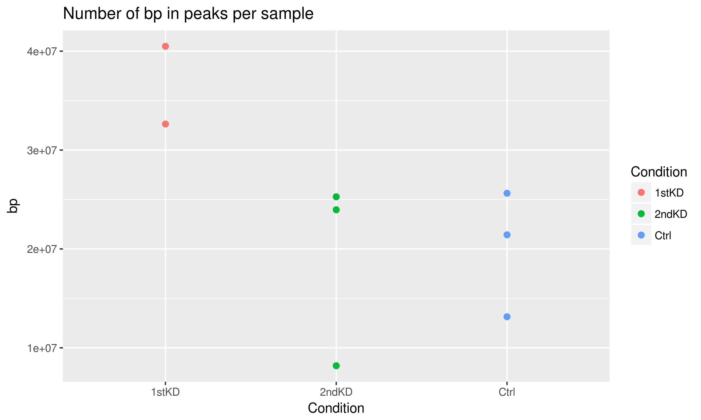
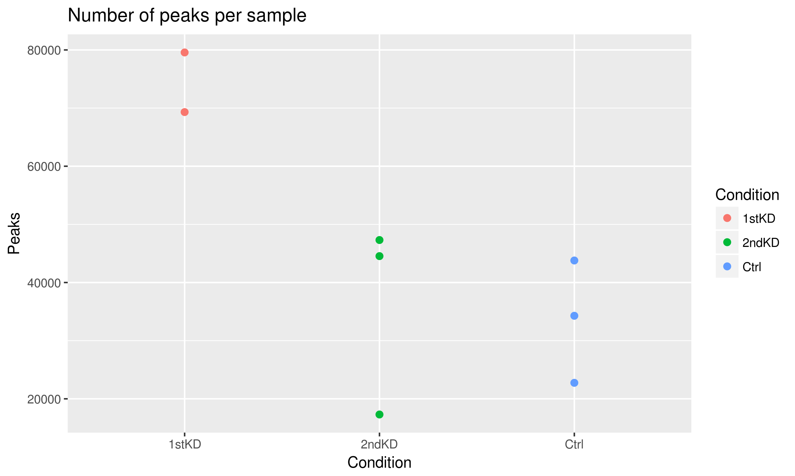
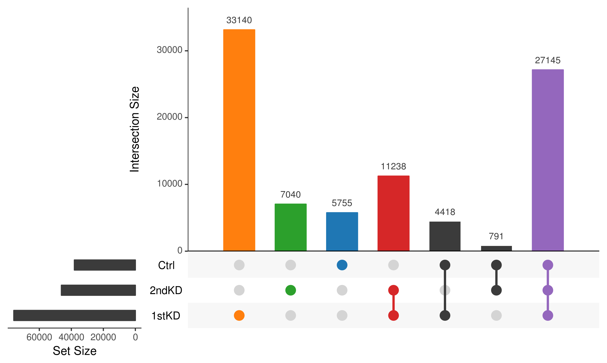
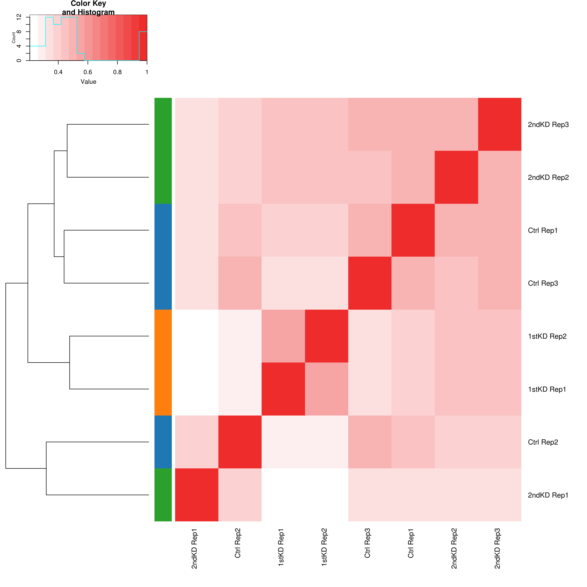

# Summary

Following up from `2018-10-10_global-accessibility/` using the re-preprocessed data and filtered peak lists from `2018-10-31_filtered-peaks/`.

## Results

### Controls tend to have less accessible chromatin, but it is not statistically significant

To see whether there are differences in global accessibility between each of the 3 conditions, we can count the number of peaks from each sample, as well as the total number of base pairs contained within peaks.

We see that using both metrics, the Control case tends to have the least accessible chromatin, whereas the TAZ knockdowns tend to have more.

None of the conditions are significantly different from each other (2 sample permutation test, see `plot-global-acc.R`).
The results of the tests are as follows:

| X       | Y     | Data  | Hypothesis | _p_   | _FDR_ |
| ------- | ----- | ----- | ---------- | ----- | ----- |
| Control | 1stKD | BP    | X >= Y     | 0.100 | 0.300 |
| Control | 2ndKD | BP    | X >= Y     | 0.581 | 0.581 |
| 1stKD   | 2ndKD | BP    | X = Y      | 0.200 | 0.300 |
| Control | 1stKD | Peaks | X >= Y     | 0.033 | 0.100 |
| Control | 2ndKD | Peaks | X >= Y     | 0.403 | 0.403 |
| 1stKD   | 2ndKD | Peaks | X = Y      | 0.133 | 0.200 |

As before, none of the associations are significant, although there's a trend towards more open chromatin in the TAZ knockdowns.

### Peak overlaps between samples

A consensus set of peaks was generated via `sh generate-consensus.sh`.
A matrix of which peaks from each sample overlapped with the consensus was generated via `Rscript create-binary-matrix.R` and the results are saved in `consensus-binary-matrix.tsv`.
The intersection plot can be seen below:

There is a core set of peaks that are shared across all 3 conditions (purple) making up about 1/3 of the consensus set.
The two knockdowns are more similar to each other than they are the control, as shown by the red and black bars.

The 1stKD is also very distinct from the other 2 conditions, as shown by the orange bar.
This isn't surprising given that the peak counts for these samples were much higher than the other 2 conditions.

### Clustering by Jaccard index

Jaccard indices of peaks from each sample give us the following clustering:

Similarly to before, the 1stKD samples are clustering together, as are 2ndKD reps 2 and 3.
Surprisingly, not all of the Ctrl samples are clustering together.
Ctrl Rep2 seems to cluster more closely to 2ndKD Rep1 (Jaccard = 0.418) instead of with the other Ctrl samples (0.435 and 0.494, respectively).

Overall, similarly to the first analysis attempt, the samples from the same condition don't cluster together as tightly as one would hope.
