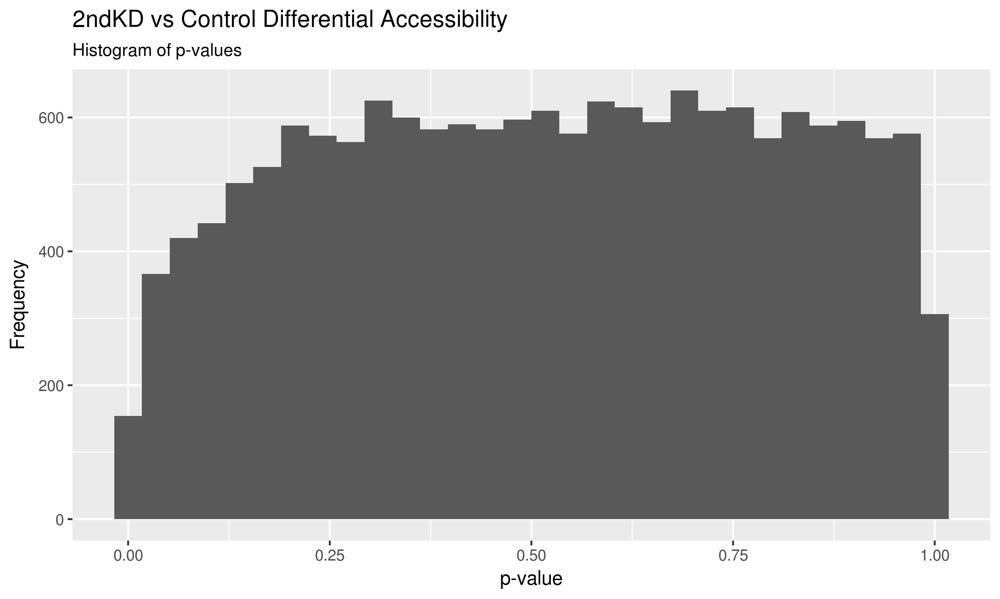

# Log

## Steps

### Calculating read depths

I've calculated the read depths for each sample in the consensus peak list by running `qsub generate-counts-in-consensus.sh`.

### DEseq

All the steps for calculating differential accessibility via read count differences between conditions can be found in `calculate-diff-acc.R`.

## 2018-11-02

The dispersion plot does look much better in this attempt than the previous one.

There are many fewer coefficients that are far from the fitted values, and it looks much more like the dispersion plot from the example data shown in the DEseq2 vignette.
There isn't a levelling of the fitted values, however.
The fit is approximately exponential (linear in log-space), and while there is some levelling near the high normalized counts, it's not nearly flat.
ATAC-seq has much lower normalized read counts than RNA-seq, however, so this may be reasonable.

I asked Aditi about this and she said that the fit still didn't seem correct.
I have a very high quantile cutoff for the 1stKD, and unsurprisingly no significant effects for the 2ndKD after multiple test correction.
She suggested to retry with a reduced set of peaks, again, possibly by limiting myself to the intersection of replicates as a set for each condition, then merging these sets to form a consensus set.

## 2018-11-05

I've done what Aditi suggested, and my results do seem cleaner.

These fitted values seem to be much cleaner overall than the two previous attempts, and I see more levelling off at high values than I have previously.

My quantile cutoff is lower than before, but still reasonably high (~ 0.6).
Again, it appears that there is no significant difference between the 2ndKD and the Ctrl.

I'll ask Aditi again tomorrow about these results, to see what these results mean to her.

## 2018-11-08

I followed up with Aditi, and I'm surprised that after following her advice of running DEseq separately on 1stKD-Ctrl and 2ndKD-Ctrl, instead of all together as I've been doing, I get no significant results in either condition.
Here are the histograms of p-values after analyzing the comparisons separately:

These are much more uniform than the ones I got when I ran all samples together:

I think this is because the 3-condition comparison uses a consensus set that is dominated by the peaks in the 1stKD.
Overall, this is very strange and I'm not sure what to do here.
I don't know if I can really make any conclusive statements with this data.
