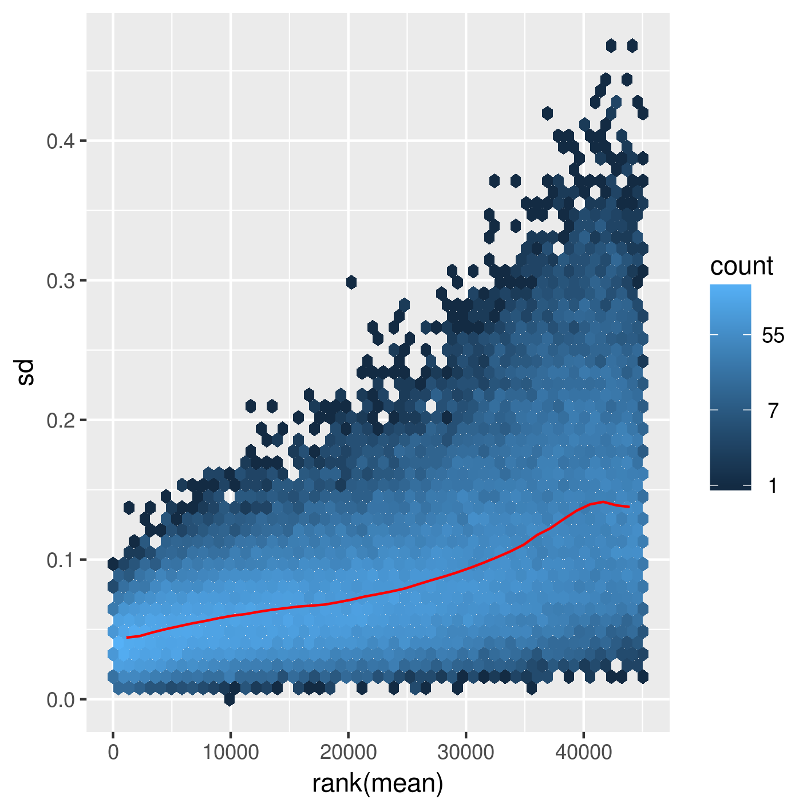

# Summary

This folder re-runs the differential accessibility analyses done in `2018-10-25_differential-accessibility/` with the re-preprocessed data.
The dataset now contains the BAM for 1stKD Rep1, so now I have 8 samples across 3 conditions to compare instead of 6 samples across 2 conditions.

## Steps

### Calculating read depths

I've calculated the read depths for each sample in the consensus peak list by running `qsub generate-counts-in-consensus.sh`.

### DEseq

All the steps for calculating differential accessibility via read count differences between conditions can be found in `DEseq/SeparatedAnalyses/calc-diff-acc_1stKD-Ctrl.R` and `DEseq/SeparatedAnalyses/calc-diff-acc_2ndKD-Ctrl.R`.

## Results

### QC plots on separated consensus lists for individual comparisons

The dispersion plots look much better in this attempt than the previous one.

There are many fewer coefficients that are far from the fitted values, and it looks much more like the dispersion plot from the example data shown in the DEseq2 vignette.
There is somewhat of a levelling of the fitted values, unlike the previous attempts.
The fit is approximately exponential (linear in log-space), and while there is some levelling near the high normalized counts, it's not nearly flat.

Other QC plots can be seen below, indicating that this seems like a reasonable fit, but not without its issues.
For example, this rlog-transformed plot showing the mean and sd show that increasing means have a higher sd in the 1stKD-vs-Ctrl comparison.

Better quality data should have a flatter relationship between the two quanitites.
This result isn't found in the vst-transformed data for the 2ndKD-vs-Ctrl comparison, for example.

Overall, the fit appears to be relatively good, but not perfect, as there is a relationship between the mean and standard deviation of the transformed normalized counts.

### No loci survive multiple testing corrections

When all 3 conditions are combined, there are a number of loci in the 1stKD that appear to be significantly differentially accessible from the Ctrl (see `DEseq/CombinedAnalyses/MA.png`).
However, when analyzed separately (i.e. a consensus list of peaks is made explicitly between the KD of interest and the Ctrl, instead of combining across all 3 conditions), there are no significant differences between the 1stKD and the Ctrl.
In neither analysis are there any significantly different loci between the 2ndKD and Ctrl.

Here are the histograms of unadjusted p-values for consideration:

As can be seen, the distribution of p-values is largely uniform, suggesting that there truly are no significant differences between the 1stKD and Ctrl, nor the 2ndKD and Ctrl.

## Conclusions

Despite there being a large (but not significant) difference in accessibility between the 1stKD and the Ctrl, there do not appear to be any loci that survive multiple test correction and show significant differential accessbility.
There also does not appear to be any significant difference between the 2ndKD and Ctrl.

One possible interpretation here, given that the replicates do not cluster as well as one would hope, is that the samples have been mislabelled (possibly through the indexes for de-multiplexing sequencing reads).
Ctrl Rep1 and 2ndKD Reps 2 and 3 consistently cluster together and have similar properties, whereas Ctrl Rep 2 and 2ndKD Rep1 are much more similar to each other and don't relate strongly to their replicates.
I'm not entirely convinced of this explanation, because Ctrl Rep3 strongly clusters with Ctrl Rep1 (as well as 2ndKD Reps 2 and 3), and no condition has 4 replicates.
This avenue may be worth exploring, but not by me.

A possible future direction would be to do some targetted ATAC-seq-like protocol.
I'm not sure if there's a qPCR-ATAC protocol, something that can explicitly look at loci near the TLR-associated genes, but that may be worth looking into, since there may be true differences between the 1stKD and Ctrl that aren't detectable with these methods due to the noise and number of loci that do not show differences in accessibility.
